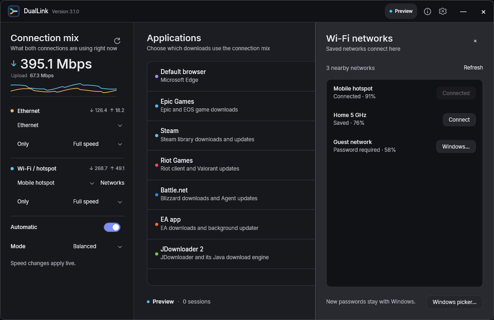
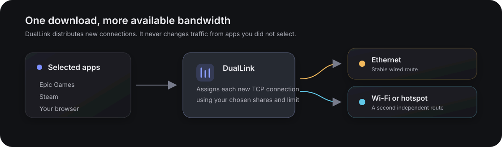
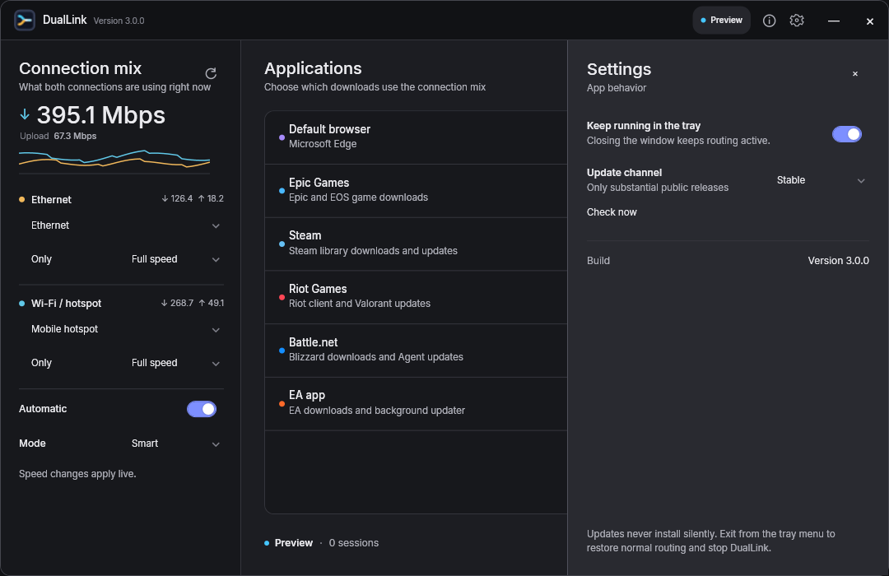
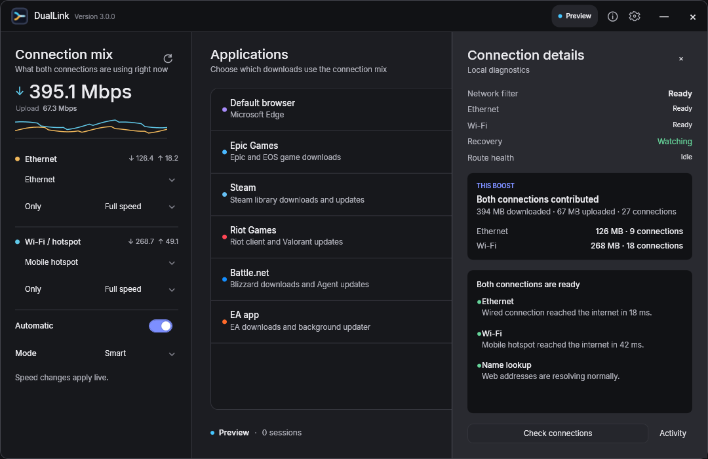
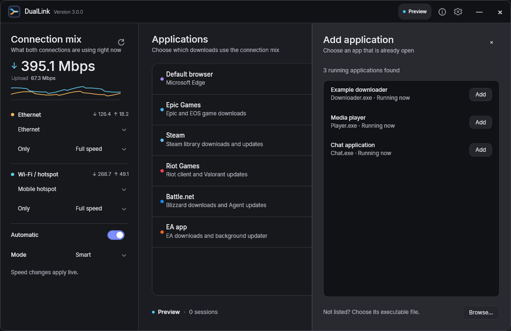

# DualLink

DualLink applies two independent internet links to new TCP connections made by selected Windows applications. It is designed for launchers and browsers that open several parallel download connections.

## Download

Download the latest offline installer from [GitHub Releases](https://github.com/Vansh-Bhardwaj/DualLink/releases/latest). It includes the required runtime, local filter, and driver. Verify the included `SHA256SUMS.txt` before running it.

## How it works

Normal Windows routing stays unchanged for everything you do not select. For selected apps, each new TCP connection is assigned to Ethernet or Wi-Fi. **Smart** favors the freer healthy link, **Balanced** follows the route speeds you choose, and **Backup** keeps one connection in reserve.

## Features

- Independent live speed control for Ethernet and Wi-Fi, including **Off**, **Only**, and **Full speed**.
- App-scoped routing for game launchers, browsers, download managers, and custom executables.
- Nearby Wi-Fi discovery with direct switching to saved Windows profiles.
- Automatic JDownloader 2 detection, including its Java download engine.
- Live per-route speed, session count, and contribution history.
- Notification-area controls, automatic recovery, and clean routing restoration on exit.
- Stable and Preview update channels with confirmation and SHA-256 verification.

## Everyday use

1. Connect Ethernet and Wi-Fi/hotspot.
2. Pick each connection. Wi-Fi choices show the connected network or hotspot name; **Networks** lists nearby SSIDs and connects saved Windows profiles directly.
3. Choose the applications and select **Enable boost**.
4. Choose a speed for each route, or select **Full speed**. A manual choice switches to **Balanced** automatically. Changes apply live; **Off** stops new connections on that route and **Only** sends new connections through it.
5. Close the window to keep DualLink in the notification area. Hover for live combined speed, connection quality, and session context, or right-click for the compact DualLink status menu. Use **Exit and restore** to return the filter to its previous configuration.

JDownloader 2 is detected together with its bundled Java download engine. For one large file, use multiple chunks when the host supports them so separate connections can use both routes; a single ordinary TCP connection cannot be split across two internet links without a remote bonding endpoint.

The Details drawer checks both routes, DNS, route independence, and filtering in plain language. Technical activity stays hidden until requested. App choices can be changed during a boost without closing established downloads.

Settings and diagnostics stay out of the way until requested

## Safety model

DualLink only filters processes the user selects. Its local proxy listens on loopback, uses fresh random credentials for each run, and is not exposed to the LAN. Disarming or exiting restores the previous ProxiFyre configuration. A small independent watchdog also restores the configuration if the UI process exits unexpectedly. Recovery paths are constrained to DualLink's own state and the expected ProxiFyre config. Adapter changes are detected automatically; an available route continues carrying new sessions while another reconnects. Turning a route off affects new connections immediately while established ones finish normally.

## Limits

One TCP connection cannot be split across two links without a remote aggregation server. The speed benefit comes from distributing the multiple connections opened by launchers and browsers. Live game traffic is intentionally not a target.

Upload results may combine less visibly than downloads. Speed tests often reuse a small number of long-lived connections for upload, and mobile hotspots usually have much lower upstream capacity. DualLink reports live upload use per route so you can see which links are contributing.

## Build from source

Developers need Windows 10/11 x64, the .NET 10 SDK, and Inno Setup 6. Run `build.ps1` to restore, test, publish, generate the SBOM and checksums, and create the offline installer in `dist`. See the [release policy](docs/RELEASE-POLICY.md) and [compliance review](docs/LEGAL-REVIEW.md) before distributing a build.

## Requirements

- Windows 10 or Windows 11, x64
- Two independently routed IPv4 internet adapters
- Administrator access for the local filter service and driver

The bundled Windows Packet Filter driver is free for personal, educational, and nonprofit use. Commercial use requires a separate driver license.

## Legal and security

DualLink is released under [AGPL-3.0-only](LICENSE). Review the [privacy statement](PRIVACY.md), [security policy](SECURITY.md), [third-party notices](THIRD-PARTY-NOTICES.md), and [release compliance review](docs/LEGAL-REVIEW.md). Release executables are currently unsigned; verify the published SHA-256 checksums before running them.
