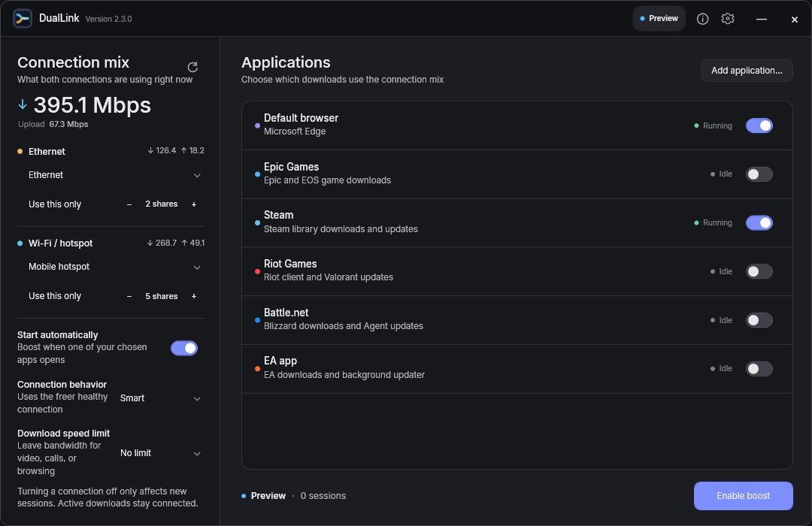

# DualLink

DualLink applies two independent internet links to new TCP connections made by selected Windows applications. It is designed for launchers and browsers that open several parallel download connections.

  

The original confluence mark depicts two network paths becoming one flow. The Windows `.ico` contains hand-rendered 16, 20, 24, 32, 40, 48, 64, 96, 128, and 256 px frames, so the shell can choose an exact size instead of enlarging a small bitmap.

## How it works

DualLink leaves normal Windows routing alone for every application you have not selected. For selected applications, each new TCP connection is assigned to Ethernet or Wi-Fi. **Smart** favors the freer healthy link, **Balanced** follows your shares, and **Backup** prefers Ethernet until it becomes unavailable.

## Everyday use

1. Connect Ethernet and Wi-Fi/hotspot.
2. Pick each connection. Wi-Fi choices show the connected network or hotspot name.
3. Choose the applications and select **Enable boost**.
4. Drag either route from **Off** through an exact Mbps cap to **Full**. Changes throttle that route's existing download and upload traffic immediately; Off leaves its current connections draining but sends no new ones there. Select **Only** to move all new connections to that route.
5. Optionally choose one total limit to leave room for streaming, calls, or browsing. It applies after the independent route limits and covers download plus upload traffic.
6. Close the window to keep DualLink in the notification area. Hover for live combined speed, connection quality, and session context, or right-click for the compact DualLink status menu. Use **Exit and restore** to return the filter to its previous configuration.

The Details drawer explains filter readiness, route quality, and whether active sessions have actually used both connections. **This boost** shows the real download, upload, and successful-connection contribution from Ethernet and Wi-Fi; these local counters reset whenever a new boost begins. **Check connections** verifies each selected route, DNS, route independence, and application filtering in plain language. Technical activity remains hidden until requested. The default browser is detected from Windows settings and added automatically. **Add application** offers visible running apps first, with executable browsing as a fallback. Custom applications are matched by their full executable path so another program with the same filename is not selected accidentally; adding the same executable again selects its existing row, and custom rows can be removed directly. Changing the chosen applications during a boost reloads only the local filter, so established proxied downloads are not closed.

While boosting, route speeds, the one-minute sparkline, and tray speed use byte counters from DualLink's own proxy, so they represent selected-application traffic rather than unrelated Windows activity. While idle, they show ordinary adapter activity. Route speed sliders act on active proxy traffic without restarting the filter, proxy, or application. Settings can check either substantial Stable releases or development Preview tags, but DualLink never downloads or installs an update silently.

Settings and diagnostics stay out of the way until requested

## Build

Requirements for developers only:

- Windows 10/11 x64
- .NET 10 SDK
- Inno Setup 6

The checked-in installer configuration is intended for a free, noncommercial release. Commercial builders must obtain the licenses identified in [the compliance review](docs/LEGAL-REVIEW.md).

Run `build.ps1`. The script restores from NuGet.org, runs the integration test, publishes a self-contained single executable, and compiles the offline installer into `dist`.

Development checkpoints use annotated `-dev.N` tags without GitHub Releases. Public Releases are reserved for substantial stable milestones that pass the complete [version and release policy](docs/RELEASE-POLICY.md).

Development of the next substantial milestone is tracked in the [DualLink 3.0 roadmap](docs/ROADMAP_3.0.md).

End users do not need .NET, ProxiFyre, Windows Packet Filter, or the Visual C++ runtime installed beforehand; the offline setup contains them.

## Safety model

DualLink only filters processes the user selects. Its local proxy listens on loopback, uses fresh random credentials for each run, and is not exposed to the LAN. Disarming or exiting restores the previous ProxiFyre configuration. A small independent watchdog also restores the configuration if the UI process exits unexpectedly. Recovery paths are constrained to DualLink's own state and the expected ProxiFyre config. Adapter changes are detected automatically; an available route continues carrying new sessions while another reconnects. A weight of zero affects new connections only.

## Limits

One TCP connection cannot be split across two links without a remote aggregation server. The speed benefit comes from distributing the multiple connections opened by launchers and browsers. Live game traffic is intentionally not a target.

Upload results may combine less visibly than downloads. Speed tests often reuse a small number of long-lived connections for upload, and mobile hotspots usually have much lower upstream capacity. DualLink reports live upload use per route so you can see which links are contributing.

## Requirements

- Windows 10 or Windows 11, x64
- Two independently routed IPv4 internet adapters
- Administrator access for the local filter service and driver

The bundled Windows Packet Filter driver is free for personal, educational, and nonprofit use. Commercial use requires a separate driver license.

## Legal and security

DualLink is released under [AGPL-3.0-only](LICENSE). Review the [privacy statement](PRIVACY.md), [security policy](SECURITY.md), [third-party notices](THIRD-PARTY-NOTICES.md), and [release compliance review](docs/LEGAL-REVIEW.md). Release executables are currently unsigned; verify the published SHA-256 checksums before running them.
