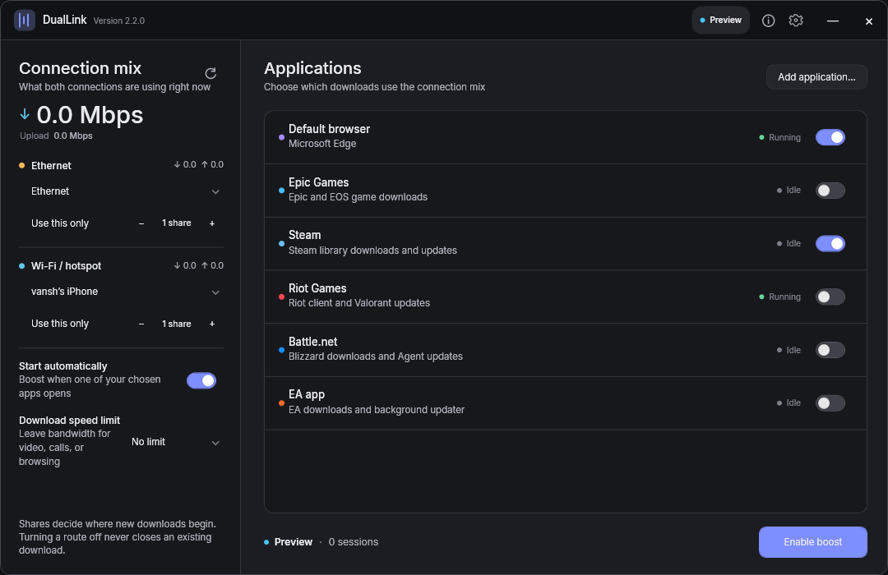

# DualLink

DualLink applies two independent internet links to new TCP connections made by selected Windows applications. It is designed for launchers and browsers that open several parallel download connections.

## How it works

DualLink leaves normal Windows routing alone for every application you have not selected. For selected applications, each new TCP connection is assigned to Ethernet or Wi-Fi according to the shares you choose.

## Everyday use

1. Connect Ethernet and Wi-Fi/hotspot.
2. Pick each connection. Wi-Fi choices show the connected network or hotspot name.
3. Choose the applications and select **Enable boost**.
4. Use **Use this only** or lower a route to **Off** when you want new connections on one link. Existing connections are left alone.
5. Optionally choose a download limit to leave bandwidth for streaming, calls, or browsing. The limit changes live.
6. Close the window to keep DualLink in the notification area. Use **Exit and restore** to return the filter to its previous configuration.

The Details drawer contains IP addresses, driver state, session count, and logs. The default browser is detected from Windows settings and added automatically.

Settings and diagnostics stay out of the way until requested

## Build

Requirements for developers only:

- Windows 10/11 x64
- .NET 10 SDK
- Inno Setup 6

The checked-in installer configuration is intended for a free, noncommercial release. Commercial builders must obtain the licenses identified in [the compliance review](docs/LEGAL-REVIEW.md).

Run `build.ps1`. The script restores from NuGet.org, runs the integration test, publishes a self-contained single executable, and compiles the offline installer into `dist`.

End users do not need .NET, ProxiFyre, Windows Packet Filter, or the Visual C++ runtime installed beforehand; the offline setup contains them.

## Safety model

DualLink only filters processes the user selects. Disarming or exiting restores the previous ProxiFyre configuration. A watchdog also restores the configuration if the UI process exits unexpectedly. A weight of zero affects new connections only.

## Limits

One TCP connection cannot be split across two links without a remote aggregation server. The speed benefit comes from distributing the multiple connections opened by launchers and browsers. Live game traffic is intentionally not a target.

Upload results may combine less visibly than downloads. Speed tests often reuse a small number of long-lived connections for upload, and mobile hotspots usually have much lower upstream capacity. DualLink reports live upload use per route so you can see which links are contributing.

## Requirements

- Windows 10 or Windows 11, x64
- Two independently routed IPv4 internet adapters
- Administrator access for the local filter service and driver

The bundled Windows Packet Filter driver is free for personal, educational, and nonprofit use. Commercial use requires a separate driver license.

## Legal and security

DualLink is released under [AGPL-3.0-only](LICENSE). Review the [privacy statement](PRIVACY.md), [security policy](SECURITY.md), [third-party notices](THIRD-PARTY-NOTICES.md), and [release compliance review](docs/LEGAL-REVIEW.md). Release executables are currently unsigned; verify the published SHA-256 checksums before running them.
