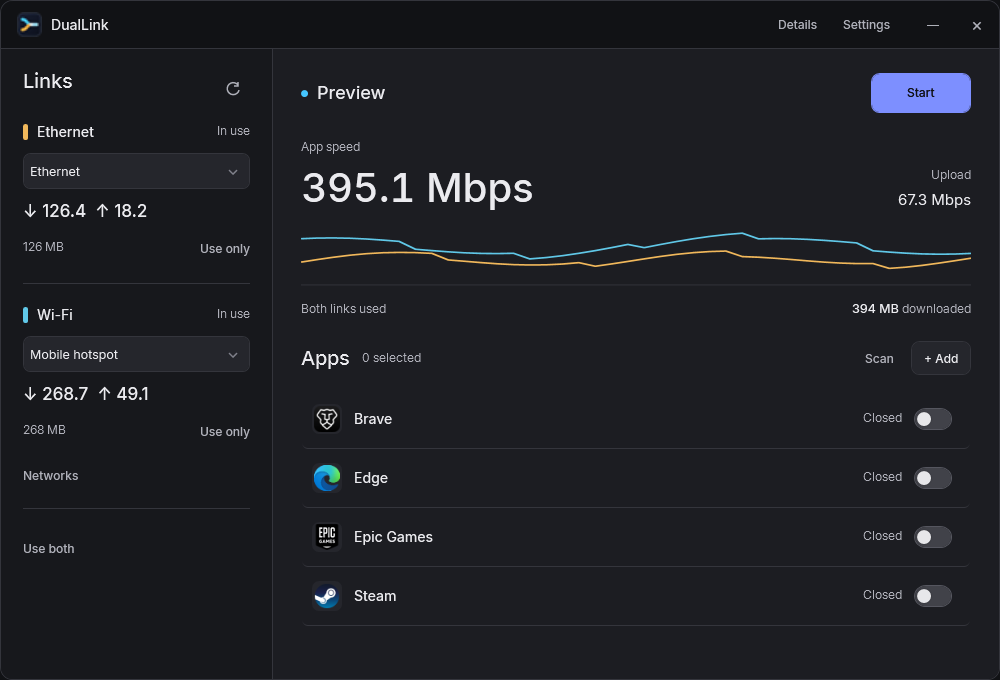
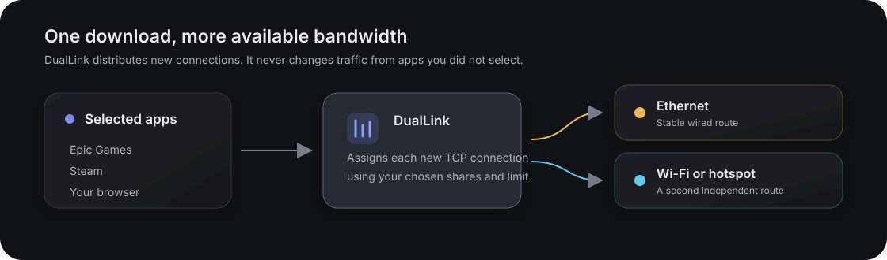
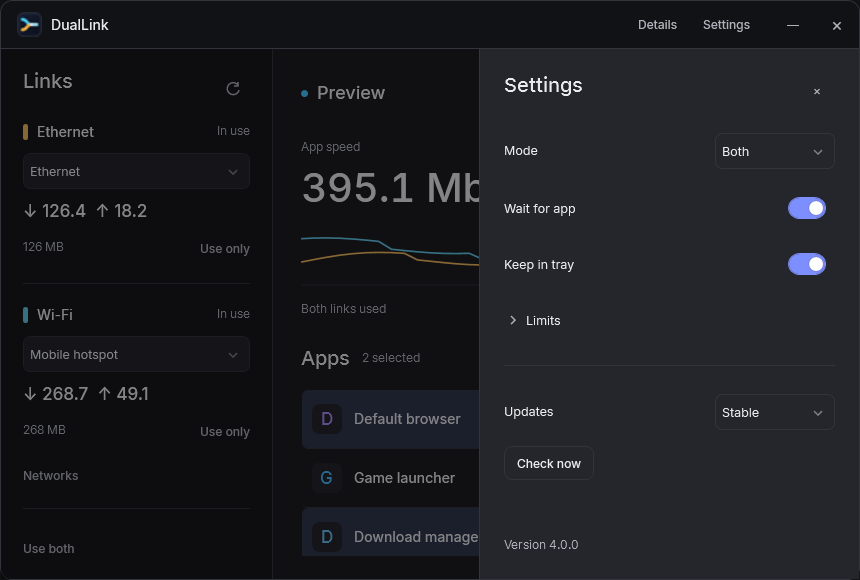
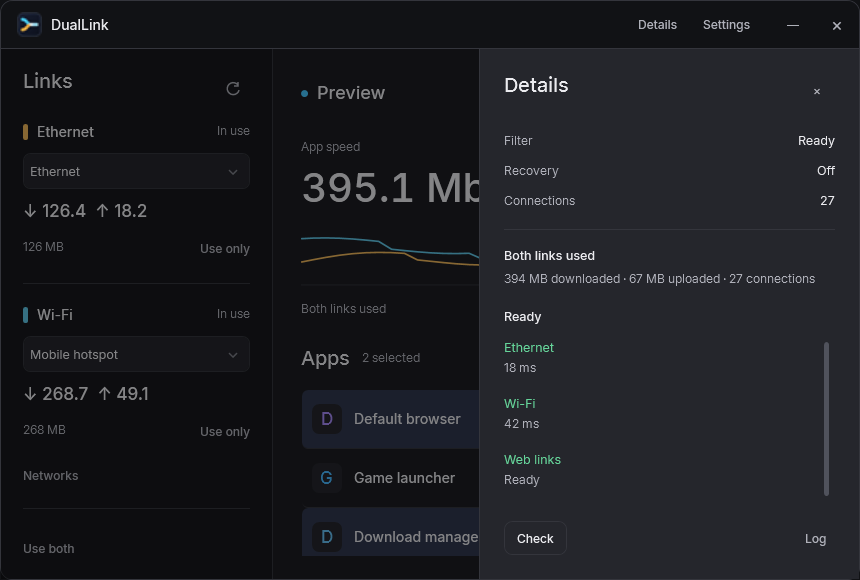
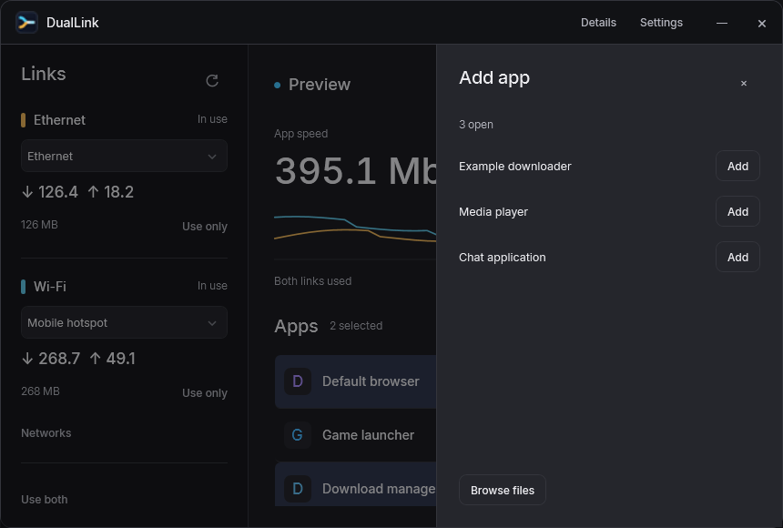

# DualLink

DualLink applies two independent internet links to new TCP connections made by selected Windows applications. It is designed for launchers and browsers that open several parallel download connections.

## Download

Download the latest offline installer from [GitHub Releases](https://github.com/Vansh-Bhardwaj/DualLink/releases/latest). It includes the required runtime, local filter, and driver. Verify the included `SHA256SUMS.txt` before running it.

## How it works

Normal Windows routing stays unchanged for apps you do not select. For selected apps, each new IPv4 TCP connection is assigned to Ethernet or Wi-Fi. **Both** shares new connections equally, **Safe** keeps destinations on a consistent link after a short startup period, and **Backup** uses Ethernet first. Speed limits are independent of the mode.

## Features

- Independent speed limits for Ethernet and Wi-Fi, with **Use only**, **Use both**, and **Full speed**.
- Automatic detection of installed supported apps, with icons extracted from their executables. Missing launchers stay out of the list.
- App-scoped routing for game launchers, browsers, download managers, and custom executables.
- Nearby Wi-Fi discovery with direct switching to saved Windows profiles.
- Automatic detection of supported multi-process download managers and their background download engines.
- Live per-route speed, session count, and contribution history.
- Notification-area controls, automatic recovery, and clean routing restoration on exit.
- Stable and Preview update channels with confirmation and SHA-256 verification.

## Everyday use

1. Connect Ethernet and Wi-Fi/hotspot.
2. Pick each connection. **Networks** opens nearby Wi-Fi choices.
3. Pick apps found on your PC and select **Start**. **Scan** checks again; **Add** accepts another running app or executable.
4. Use **Use only** or **Use both** to choose links. Optional limits and routing mode live in **Settings**. A limit changes bandwidth without changing the mode. Disabled links stop receiving new connections while existing transfers finish.
5. **Stop** restores the previous filter configuration. Closing keeps DualLink in the tray when **Keep in tray** is enabled.

For one large file, use multiple chunks when the host supports them so separate connections can use both routes. A single ordinary TCP connection cannot be split across two internet links without a remote bonding endpoint.

The Details drawer checks both routes, DNS, route independence, and filtering in plain language. Technical activity stays hidden until requested. App choices can be changed during a boost without closing established downloads.

Settings and diagnostics stay out of the way until requested

## Safety model

DualLink only filters processes the user selects. The desktop interface runs with normal user permissions; Windows asks for administrator approval only when the user enables boosting. Its elevated local helper owns packet-filter changes and the local proxy, which listens only on loopback, uses fresh random credentials for each run, and is not exposed to the LAN. Disarming or exiting restores the previous local-filter configuration. An independent watchdog also restores that configuration if the interface or helper exits unexpectedly. Adapter changes are detected automatically; an available route continues carrying new sessions while another reconnects. Turning a route off affects new connections immediately while established ones finish normally.

## Limits

One TCP connection cannot be split across two links without a remote aggregation server. The speed benefit comes from distributing the multiple connections opened by launchers and browsers. Live game traffic is intentionally not a target.

DualLink routes IPv4 TCP. Its explicit filter rule blocks selected-app IPv6 so applications can fall back to IPv4; an IPv6-only destination cannot work through this mode. UDP, including QUIC and most live game traffic, is outside the routed path. **Open** means the app process exists, not that it is sending routed traffic. Link byte counts are the evidence of actual use.

The detection catalog includes Steam, Epic Games, Riot Games, Battle.net, EA app, JDownloader, Chrome, Edge, Firefox, Brave, Opera, Internet Download Manager, and Free Download Manager. Registrations, known folders, or a running executable must provide an existing path. Portable or unusual installations can be added manually. Detection is not a certification that every app version or server benefits from dual-link routing.

See the [project audit](docs/PROJECT-AUDIT-2026-10-07.md) and [implementation and validation record](docs/IMPLEMENTATION-2026-10-07.md) for the current fixes, benchmark, and outstanding live validation.

Upload results may combine less visibly than downloads. Speed tests often reuse a small number of long-lived connections for upload, and mobile hotspots usually have much lower upstream capacity. DualLink reports live upload use per route so you can see which links are contributing.

## Build from source

Developers need Windows 10/11 x64, the .NET 10 SDK, and Inno Setup 6. Run `build.ps1` to restore, test, publish, generate the SBOM and checksums, and create the offline installer. The exact three public assets are placed in `dist\release`; other files under `dist` are internal build outputs. See the [release policy](docs/RELEASE-POLICY.md) and [compliance review](docs/LEGAL-REVIEW.md) before distributing a build.

## Requirements

- Windows 10 or Windows 11, x64
- Two independently routed IPv4 internet adapters
- Administrator approval when enabling the local filter helper

## Legal and security

DualLink is released under [AGPL-3.0-only](LICENSE). Review the [privacy statement](PRIVACY.md), [security policy](SECURITY.md), [third-party notices](THIRD-PARTY-NOTICES.md), and [release compliance review](docs/LEGAL-REVIEW.md). Release executables are currently unsigned; verify the published SHA-256 checksums before running them.
